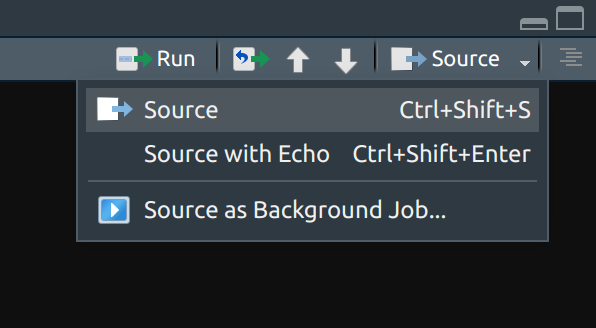
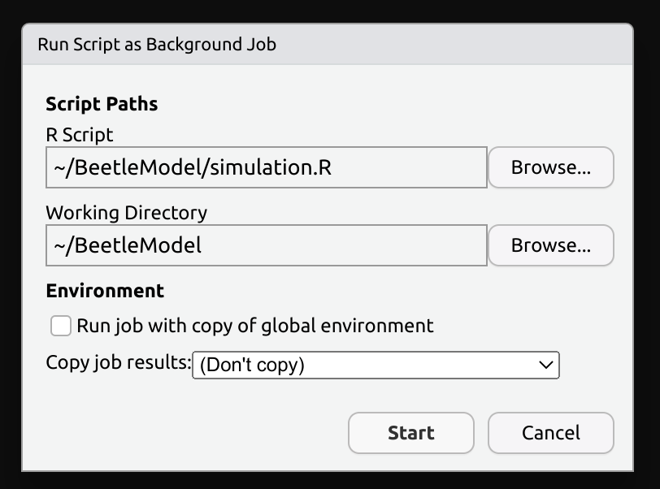
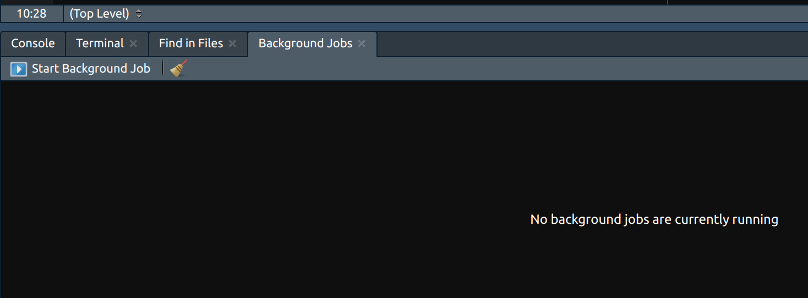

# Run R-scripts in RStudio as background jobs

## Why?
When you run a script in RStudio, it will be started in the same process as RStudio itself. For scripts that take a while to finish, sometimes days, this means your RStudio will become unresponsive and you might not be able to login to your RStudio server until your script finished. The solution to this is to run your script in a different process, as a background job.

## How?
1. Save your script in a file. It must be source-able, i.e. run without any manual interference.
```R
# Example R script
library(readr)
library(myPackage)

fieldParameter <- read_csv("raw_data/fieldParameter.csv")
landscapes <- read_csv("raw_data/landscapes.csv")

run_simulations(model_parameter = fieldParameter, 
                landscapes = landscapes, 
                max_runtime = 1000, 
                seed = 123)
```

2. Click at the top-right of the scripting-area in RStudio on `Source` -> `Source as Background Job`. To see this option, you need to click on the small triangular arrow, not the button itself.


3. In the options, I suggest *not* to run the job with a copy of the global environment because this might mess up your results. In `Copy job results` I usually either use the default (Don't copy) when I store the results on disk or to results object in the global environment to avoid any confusion with my current data objects.


4. You can monitor (or stop) your background jobs in a tab next to the R Console. Stopping parallelized jobs might take some time.



---
References: 
Related: 
