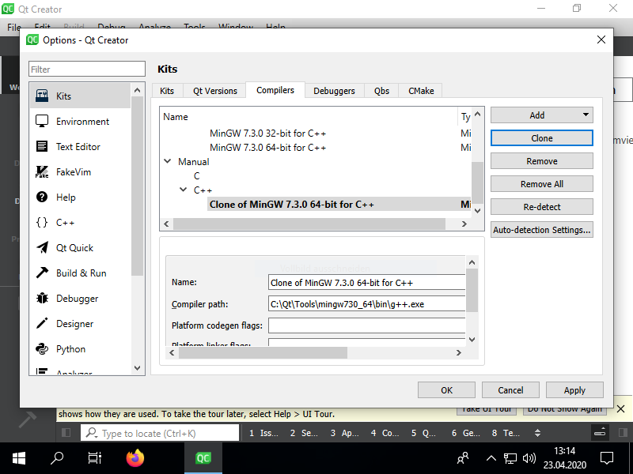
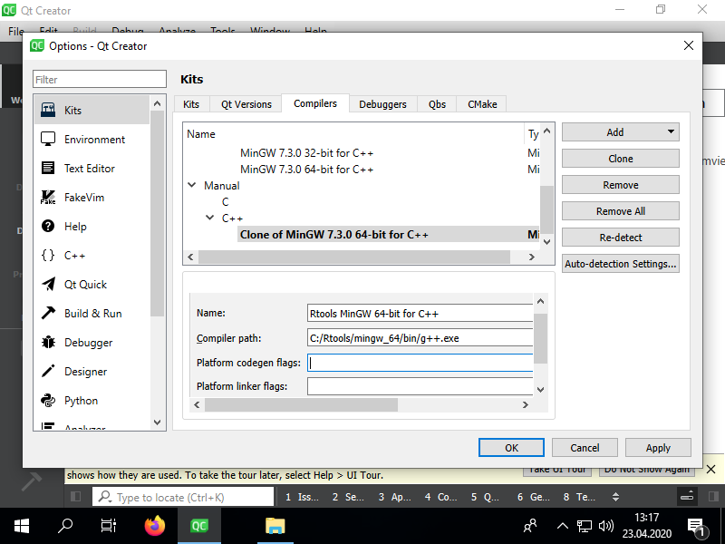
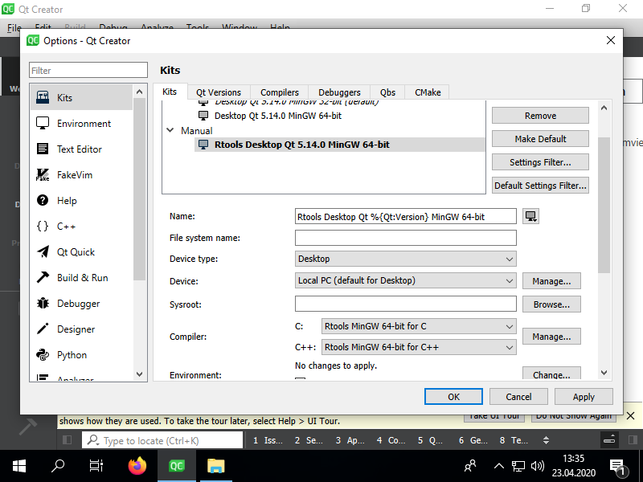
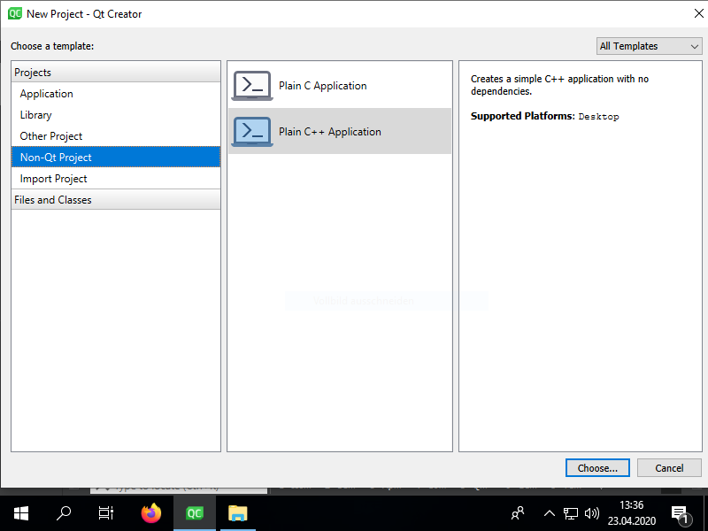
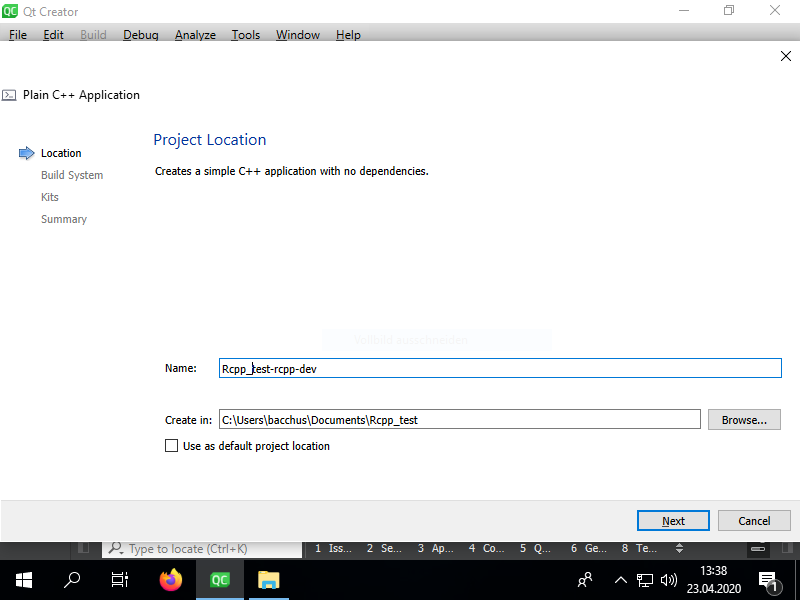
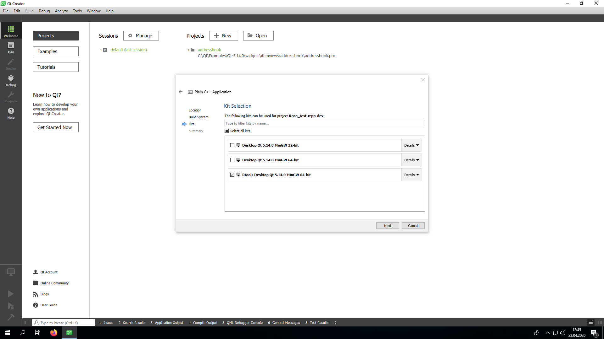

# [[Rcpp]] and [[Qt Creator]]

## Motivation

- RStudio is a great IDE for R, but its C++ support is limited
- Debugging C++ code is difficult with RStudio
- Qt Ceator is a great IDE for C++ and works very well for debugging

## Prerequisites

- [Install and setup R, RStudio, Rcpp](Install%20and%20setup%20R,%20RStudio,%20Rcpp.md)
- [Set PATH environment variable for R and Rtools in ](Set%20PATH%20environment%20variable%20for%20R%20and%20Rtools%20in%20.md)
- [[Install Qt Creator]]
- Create an [Setup an R-Package with Rcpp in RStudio](Setup%20an%20R-Package%20with%20Rcpp%20in%20RStudio.md)

## Add the Rtools compiler to Qt Creator (Windows only)

- be careful not to mix up the 32-bit versions with the 64-bit versions
- in *Tools* > *Options* > *Kits* in the *Compilers* tab select a **MinGW C++ compiler** and *Clone* it:



- change the name of the cloned compiler to, e.g. *Rtools MinGW C++* and change the *Compiler path* the **g++.exe** of your Rtools installation:



- Just as with the C++ compiler, also clone the **MinGW C compiler**, rename the cloned compiler and change the *Compiler path* to the **gcc.exe** of your Rtools installation
- Select the *Kits* tab and clone a default Kit. Clone a 64-bit kit if you want to use a 64-bit compiler or a 32-bit kit to use with a 32-bit compiler. Rename it and select the newly added C and C++ compilers from your Rtools installation:



- Be aware, you cannot use the Qt libraries with the Rtools compiler

## Create a C++ Project in Qt Creator

- New Project > Non-Qt Project > Plain C++ Application



- Give the project a meaningful name. I usually use *packagename*-rcpp-dev and create it in the R-Project's folder structure:



- Windows: choose a Kit with the Rtools compiler & next, next, finish :-)



## Add the Rcpp and RInstide libraries

- in your *.pro file, add:

```qmake
## Template from the example at http://dirk.eddelbuettel.com/blog/2011/03/25/#rinside_and_qt

## comment this out if you need a different version of R,
## and set set R_HOME accordingly as an environment variable
R_HOME = $$system(R RHOME)

## include headers and libraries for R
RCPPFLAGS = 		$$system($$R_HOME/bin/R CMD config --cppflags)
RLDFLAGS = 		$$system($$R_HOME/bin/R CMD config --ldflags)
RBLAS = 		$$system($$R_HOME/bin/R CMD config BLAS_LIBS)
RLAPACK = 		$$system($$R_HOME/bin/R CMD config LAPACK_LIBS)

## if you need to set an rpath to R itself, also uncomment
RRPATH =		-Wl,-rpath,$$R_HOME/lib

## include headers and libraries for Rcpp interface classes
## note that RCPPLIBS will be empty with Rcpp (>= 0.11.0) and can be omitted
RCPPINCL = 		$$system($$R_HOME/bin/Rscript -e \"Rcpp:::CxxFlags\(\)\")
RCPPLIBS = 		$$system($$R_HOME/bin/Rscript -e \"Rcpp:::LdFlags\(\)\")

## include headers and libraries for RInside embedding classes
RINSIDEINCL = 		$$system($$R_HOME/bin/Rscript -e \"RInside:::CxxFlags\(\)\")
RINSIDELIBS = 		$$system($$R_HOME/bin/Rscript -e \"RInside:::LdFlags\(\)\")

## compiler etc settings used in default make rules
QMAKE_CXXFLAGS +=	$$RCPPWARNING $$RCPPFLAGS $$RCPPINCL $$RINSIDEINCL
QMAKE_LIBS +=           $$RLDFLAGS $$RBLAS $$RLAPACK $$RINSIDELIBS $$RCPPLIBS
```

## Use R, Rcpp and C++ seamlessly

- Add your Rcpp files just like any other file to your project in Qt Creator, i.e. right-click on the project name in the project structure > Add existing files and add all C++ files you need:


- you can embed an R session like this:

```c++
#include <iostream>
#include <RInside.h>

using namespace std;
using namespace Rcpp;

int main()
{
    RInside R; // this is an R session, yay!
    R.parseEvalQ("i <- 5 + 5");
    int x = R["i"];
    cout << "Hello " << x << endl;

    IntegerVector vec = R.parseEval("seq(0, 100, 7)");

    cout << "\nHello vector:"<< endl;
    for (unsigned i = 0; i < vec.size(); i++) {
       cout << vec[i] << " ";
    }
    cout << endl;

    return 0;
}
```

- Debugging works as usual, with the exception, that you can't see the values that are stored in Rcpp objects. That's because Rcpp objects are just wrappers to C-pointers (called *SEXP*) that point to memory locations of R-objects. But fortunately, it is often trivial to convert Rcpp objects to C++ objects:


# Further reading on Rcpp

[Rcpp Links](Rcpp%20Links.md)

---

References:
Related:
